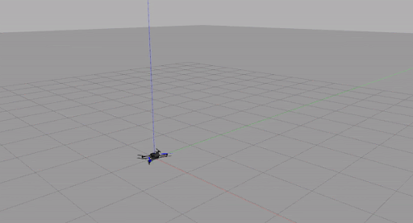
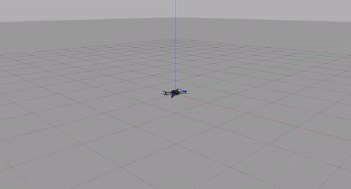
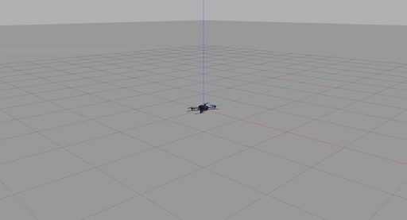
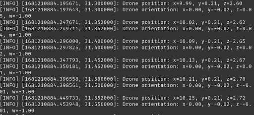

# PX4-Offboard-control-using-MAVROS
Python codes for MAVROS Offboard control

## Results

### Position Setpoints

&ensp;&ensp;&ensp;&ensp;&ensp;&ensp;&ensp;&ensp;&ensp;&ensp;&ensp;&ensp;&ensp;&ensp;&ensp;&ensp;&ensp;&ensp;&ensp;&ensp;&ensp;&ensp;&ensp;&ensp;&ensp;&ensp;&ensp;&ensp;&ensp;&ensp; x = 3, y = 3, z = 2

### Attitude Setpoints

&ensp;&ensp;&ensp;&ensp;&ensp;&ensp;&ensp;&ensp;&ensp;&ensp;&ensp;&ensp;&ensp;&ensp;&ensp;&ensp;&ensp;&ensp;&ensp;roll = 0, pitch = 0, yaw = $\pi/2$

### Velocity Setpoints

&ensp;&ensp;&ensp;&ensp;&ensp;&ensp;&ensp;&ensp;&ensp;&ensp;&ensp;&ensp;Linear velocities: ${v_x = 0.25, v_y = 0.0, v_z = 0.5}$
 &ensp;&ensp;&ensp;&ensp;&ensp;&ensp;&ensp;&ensp;&ensp;&ensp;&ensp;&ensp;Angular velocities: ${v_x = 0.0, v_y = 0.0, v_z = 1.0}$

### Reading the present state of the drone

&ensp;&ensp;&ensp;&ensp;&ensp;&ensp;&ensp;&ensp;&ensp;&ensp;&ensp;&ensp;&ensp;&ensp;&ensp;Drone Position & Drone Orientation

